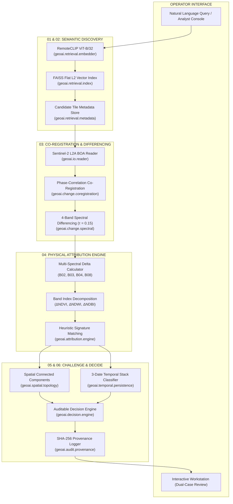

# TERRAE — Earth Intelligence
### SIH26227 · Satellite Investigation Console

> **Natural-language satellite investigation across space and time with physical multi-spectral attribution, spatial coherence verification, and auditable analyst review.**

---

## 1. Quick Access & Live Infrastructure

| Service | Platform | Endpoint / URL | Operational Scope |
| :--- | :--- | :--- | :--- |
| **Production Web Console** | **Vercel** | **[https://terrae-geospatial-intelligence.vercel.app](https://terrae-geospatial-intelligence.vercel.app)** | Primary Next.js 14 investigation console & browser workstation |
| **Production Mirror** | **Vercel** | **[https://terrae-earth-intelligence.vercel.app](https://terrae-earth-intelligence.vercel.app)** | High-availability global deployment mirror |
| **Backend REST API** | **Render** | **[https://terrae-backend.onrender.com](https://terrae-backend.onrender.com)** | Live FastAPI service with OpenAPI / Swagger testbed |
| **Interactive API Docs** | **Render** | **[https://terrae-backend.onrender.com/docs](https://terrae-backend.onrender.com/docs)** | Interactive Swagger UI API documentation |
| **Health & Liveness Probe** | **Render** | **[https://terrae-backend.onrender.com/health](https://terrae-backend.onrender.com/health)** | Operational health probe (`{"status": "healthy"}`) |
| **System Status & Telemetry**| **Render** | **[https://terrae-backend.onrender.com/api/status](https://terrae-backend.onrender.com/api/status)** | FAISS vector count & pipeline capability matrix |
| **Analyst Workstation View** | **Vercel** | **[Direct Workstation View](https://terrae-geospatial-intelligence.vercel.app/?mode=workstation)** | Deep inspection console with dual-case comparative telemetry |
| **GitHub Source Repository** | **GitHub** | **[PhantomCipher13/terrae-geospatial-intelligence](https://github.com/PhantomCipher13/terrae-geospatial-intelligence)** | Authoritative source tree, benchmarks, and test suites |

---

## 2. 30-Second Overview

Traditional satellite change detection tools flag differences indiscriminately. A passing cloud, a shift in solar illumination angle, changes in soil moisture, or seasonal agricultural harvest routinely trigger false-positive alarms that overwhelm intelligence and civilian monitoring teams.

**TERRAE** fundamentally rethinks satellite change investigation:
1. **Natural-Language Discovery**: The operator asks what they are investigating (e.g., *"new construction and building development"* or *"agricultural vegetation greening"*).
2. **Multimodal Semantic Retrieval**: RemoteCLIP (ViT-B/32) vision-language embeddings query an in-memory FAISS Flat L2 vector index to retrieve matching candidate geographic regions with zero external network overhead.
3. **Sub-Pixel Co-Registration & Differencing**: Temporal observation pairs are aligned to sub-pixel accuracy before 4-band normalized Euclidean spectral differencing ($\tau = 0.15$) isolates genuine radiometric divergence.
4. **Physical Multi-Spectral Attribution**: Instead of an opaque binary mask, the engine computes multi-spectral delta vectors ($\Delta\text{NIR}, \Delta\text{Red}, \Delta\text{NDVI}, \Delta\text{NDWI}$) to separate built-surface developments from seasonal phenology cycles.
5. **Spatial Topology & Temporal Trajectory**: Connected-component analysis measures cluster compactness, while a 3-date observation stack ($T_0 \to T_{\text{mid}} \to T_1$) determines whether the change is persistent or ephemeral.
6. **Auditable Decision Layer**: Produces an auditable verdict—**`SUPPORTED`**, **`REVIEW`**, or **`ABSTAIN`**—backed by a cryptographic SHA-256 provenance trail.

---

## 3. Why This Is Not Just a Change Detector

| Dimension | Traditional Pixel Differencing (Otsu / CVA) | Black-Box Deep Learning (Bi-Temporal CNN / Transformer) | **TERRAE (Earth Intelligence Console)** |
| :--- | :--- | :--- | :--- |
| **Core Paradigm** | Raw pixel subtraction | End-to-end classification probability | **Evidence-Based Physical Attribution** |
| **Input Modality** | Fixed image pair coordinates | Fixed image pair bounding box | **Natural-language intent + Multi-date satellite stack** |
| **Co-Registration** | Assumed pre-aligned (fails on sub-pixel drift) | Learned spatial invariance (unverifiable) | **Phase-correlation sub-pixel co-registration** |
| **Attribution Output** | Unclassified binary mask (0 or 1) | Uncalibrated continuous probability ($0.0 - 1.0$) | **Multi-spectral delta vectors ($\Delta\text{NIR}, \Delta\text{Red}, \Delta\text{NDVI}$)** |
| **False-Positive Handling** | None (crops, shadows, and soil flag as changes) | Data-dependent (frequent phenology hallucination) | **3-date trajectory modeling (5 MECE categories)** |
| **Spatial Geometry** | Isolated noisy pixels | Heatmap blobs | **Connected-component spatial coherence ratio** |
| **Decision Output** | Opaque threshold alert | Unexplainable binary prediction | **Auditable verdict (`SUPPORTED` / `REVIEW` / `ABSTAIN`)** |
| **Provenance & Audit** | None | Model checkpoint hash only | **SHA-256 data & algorithm evidence provenance chain** |
| **Air-Gap / Offline** | Varies | Often requires cloud API dependencies | **100% Air-gapped (`HF_HUB_OFFLINE=1`, zero network calls)** |

> [!NOTE]
> **Scientific Integrity Principle**: Attribution scores in TERRAE represent heuristic support for candidate change signatures, not calibrated Bayesian probabilities or legal causal claims. The console provides structured, reproducible physical evidence to accelerate human analyst investigation.

---

## 4. Core Workflow: The 6-Stage Investigation Protocol

```
   ┌─────────┐      ┌────────────┐      ┌───────────┐
   │ 01 ASK  │ ───► │ 02 DISCOVER│ ───► │ 03 COMPARE│
   └─────────┘      └────────────┘      └───────────┘
                                              │
   ┌──────────┐     ┌────────────┐            ▼
   │ 06 DECIDE│ ◄───│05 CHALLENGE│ ◄─── ┌───────────┐
   └──────────┘     └────────────┘      │ 04 EXPLAIN│
                                        └───────────┘
```

### Stage 01: ASK — Query Intent & Hypothesis
- **Input**: Natural-language query string (e.g., *"new construction and buildings"*).
- **Processing**: The query planner maps linguistic intent into expected physical surface reflectance shifts (e.g., built construction implies $\Delta\text{Red} > 0, \Delta\text{NIR} < 0, \Delta\text{NDVI} \ll 0$).
- **Output**: Target spectral shift hypothesis vector.

### Stage 02: DISCOVER — Multimodal Semantic Retrieval
- **Input**: Text query hypothesis.
- **Processing**: The query is projected into a 512-dimensional normalized embedding via RemoteCLIP (ViT-B/32). An in-memory FAISS Flat L2 vector index queries pre-embedded Sentinel-2 tile archives in $< 1\text{ms}$.
- **Output**: Top candidate scenes ranked by cosine similarity with geographic coordinates and acquisition timestamps.

### Stage 03: COMPARE — Temporal Co-Registration & Spectral Differencing
- **Input**: Bi-temporal or multi-temporal co-registered Sentinel-2 L2A tile pairs ($T_0, T_1$).
- **Processing**: Phase-correlation verifies sub-pixel alignment ($\Delta \le 0.05\text{px}$). Normalized Euclidean distance computes 4-band spectral divergence:
  $$d(x, y) = \frac{\|x - y\|_2}{\sqrt{C}}$$
  Pixels exceeding $\tau = 0.15$ form the candidate change mask. Cloud/shadow pixels are eliminated using the Sentinel-2 Scene Classification Layer (SCL).
- **Output**: Sub-pixel verified change mask and divergent pixel cluster coordinates.

### Stage 04: EXPLAIN — Physical Multi-Spectral Attribution
- **Input**: Divergent pixel clusters and 4-band surface reflectance arrays.
- **Processing**: Computes band-by-band reflectance deltas ($\Delta\text{Blue}, \Delta\text{Green}, \Delta\text{Red}, \Delta\text{NIR}$) and vegetation/water index deltas ($\Delta\text{NDVI}, \Delta\text{NDWI}$). Evaluates heuristic signature matching across built-surface, vegetation dynamics, soil exposure, water fluctuation, and ephemeral artifacts.
- **Output**: Decomposed physical attribution support scores (%) and primary interpretation.

### Stage 05: CHALLENGE — Spatial Coherence & Multi-Date Trajectory
- **Input**: Divergent mask, attribution vector, and 3-date observation stack ($T_0, T_{\text{mid}}, T_1$).
- **Processing**: 
  - *Spatial Topology*: Connected-component analysis computes cluster area, perimeter, and the spatial coherence ratio ($A / A_{\text{hull}}$). Compact geometries corroborate built infrastructure; dispersed single pixels indicate noise.
  - *Temporal Persistence*: Classifies the multi-date stack into 5 Mutually Exclusive & Collectively Exhaustive (MECE) trajectory categories to distinguish permanent development from reversible phenology.
- **Output**: Spatial coherence percentage and verified temporal trajectory class.

### Stage 06: DECIDE — Auditable Conclusion & Cryptographic Provenance
- **Input**: Synthesized physical attribution, spatial coherence, and temporal trajectory.
- **Processing**: A conservative multi-criteria decision rule evaluates whether the evidence satisfies affirmative thresholds. If change is sub-threshold or ambiguous, the engine issues `REVIEW` or `ABSTAIN` rather than generating false alarms. Every piece of input data, intermediate vector, and algorithm parameter is hashed into a SHA-256 audit record.
- **Output**: Final analyst verdict (`SUPPORTED` / `REVIEW` / `ABSTAIN`), full provenance record, and interactive workstation plate.

---

## 5. System Architecture



### Module Mapping
| Module | Location | Responsibility |
| :--- | :--- | :--- |
| **`geoai.retrieval`** | `geoai/retrieval/` | RemoteCLIP text/image embedding providers, FAISS index construction, similarity search |
| **`geoai.change`** | `geoai/change/` | Co-registration, multi-band Euclidean differencing, adaptive thresholding |
| **`geoai.attribution`** | `geoai/attribution/` | Heuristic signature matching, spectral delta calculations ($\Delta\text{NIR}, \Delta\text{Red}, \Delta\text{NDVI}$) |
| **`geoai.temporal`** | `geoai/temporal/` | 3-date observation stack processing, 5 MECE trajectory classification |
| **`geoai.spatial`** | `geoai/spatial/` | 8-connected component clustering, cluster compactness, coherence metrics |
| **`geoai.decision`** | `geoai/decision/` | Multi-pillar evidence synthesis, conservative verdict rules (`SUPPORTED`/`REVIEW`/`ABSTAIN`) |
| **`geoai.audit`** | `geoai/audit/` | SHA-256 cryptographic provenance hashing, timestamp verification, reproducible run logs |
| **`api`** | `api/` | Production FastAPI endpoints (`/health`, `/docs`, `/api/search`, `/api/status`, `/api/cases/*`) |
| **`frontend`** | `frontend/` | Next.js 14 responsive investigation console, touch-enabled wipe slider, workstation |
| **`ui`** | `ui/` | Local desktop Streamlit research and demonstration console |

---

## 6. Technology Stack

- **Computer Vision & Vision-Language**: RemoteCLIP (ViT-B/32 backbone, 512-dim normalized embedding space), PyTorch 2.0+, Torchvision.
- **Vector Search**: FAISS (Facebook AI Similarity Search) Flat L2 in-memory index.
- **Geospatial Processing**: NumPy, SciPy (`ndimage` connected components), Rasterio, GDAL bindings, PIL image fallback.
- **Backend Web Service**: FastAPI, Uvicorn, Pydantic v2 schemas.
- **Frontend Console**: Next.js 14, React 18, CSS Custom Properties, Headless responsive viewport architecture.
- **Desktop Research Console**: Streamlit, Matplotlib.
- **Testing & Verification**: Pytest, Selenium Headless Chrome DevTools Protocol test suite.
- **Deployment Environments**: Vercel (Frontend edge), Render (Backend Python service), Local Air-Gapped Workstation.

---

## 7. Scientific Pipeline & Mathematical Formulations

### 1. Sentinel-2 Band Selection
TERRAE operates on Sentinel-2 Level-2A Bottom-Of-Atmosphere (BOA) surface reflectance:
- **B02 (Blue)**: 490 nm center, 10m Ground Sample Distance (GSD)
- **B03 (Green)**: 560 nm center, 10m GSD
- **B04 (Red)**: 665 nm center, 10m GSD (chlorophyll absorption)
- **B08 (NIR)**: 842 nm center, 10m GSD (canopy mesophyll reflectance)

### 2. Multi-Band Spectral Differencing
For co-registered observation vectors $x, y \in \mathbb{R}^C$ where $C=4$:
$$d(x, y) = \frac{\|x - y\|_2}{\sqrt{C}} = \frac{1}{\sqrt{C}} \sqrt{\sum_{i=1}^C (x_i - y_i)^2}$$
A pixel $p$ is marked divergent if:
$$d(x_p, y_p) \ge \tau \quad (\text{calibrated threshold } \tau = 0.15)$$

### 3. Spectral Index Differencing
$$\text{NDVI} = \frac{\text{B08} - \text{B04}}{\text{B08} + \text{B04}}, \quad \Delta\text{NDVI} = \text{NDVI}_{T_1} - \text{NDVI}_{T_0}$$
$$\text{NDWI} = \frac{\text{B03} - \text{B08}}{\text{B03} + \text{B08}}, \quad \Delta\text{NDWI} = \text{NDWI}_{T_1} - \text{NDWI}_{T_0}$$

### 4. Spatial Coherence Ratio
For a set of divergent pixels forming connected components $\{K_1, K_2, \dots, K_m\}$:
$$\text{Coherence} = \frac{\sum_{i=1}^m |K_i| \cdot \mathbb{I}(|K_i| \ge \kappa)}{\sum_{i=1}^m |K_i|}$$
where $\kappa$ is the minimum cluster area threshold ($\kappa = 9\text{ pixels}$ at 10m GSD).

---

## 8. Temporal Persistence & Phenology Discrimination

Single-pair change detection cannot distinguish permanent structural changes from cyclical phenology. TERRAE enforces a **3-observation temporal stack** across a calendar horizon:
- **$T_0$**: Baseline observation (e.g., pre-monsoon dry season)
- **$T_{\text{mid}}$**: Intermediate observation (e.g., peak monsoon vegetative flush)
- **$T_1$**: Target observation (e.g., post-harvest dormancy)

### 5 MECE Trajectory Classifications
1. **`PERSISTENT_CHANGE`**: Divergence emerges in $T_0 \to T_{\text{mid}}$ and persists or expands in $T_{\text{mid}} \to T_1$. Reflects true physical land transformation (construction, deforestation, asphalt paving).
2. **`REVERSIBLE_PHENOLOGY`**: Divergence surges in $T_0 \to T_{\text{mid}}$ (vegetative growth) but returns toward baseline in $T_{\text{mid}} \to T_1$ (crop harvest or leaf drop). Suppressed from alerting.
3. **`LATE_ONSET_CHANGE`**: Stable across $T_0 \to T_{\text{mid}}$, with divergence emerging exclusively in $T_{\text{mid}} \to T_1$. Corroborates recent construction ground-breaking.
4. **`TRANSIENT_VARIATION`**: Ephemeral anomaly present only in a single intermediate date (standing water from heavy rain, localized sensor flare). Suppressed from alerting.
5. **`STABLE_UNMODIFIED`**: Radiometric shifts remain within the noise threshold $\epsilon$ across all three dates.

---

## 9. Real Sentinel-2 Validation: MGRS Tile 43RGM

- **Geographic Location**: National Capital Region (NCR) agrarian/semi-urban plain, India ($28.5215^\circ\text{ N}, 77.4782^\circ\text{ E}$).
- **Tile Dimensions**: $512 \times 512\text{ pixels}$ ($262,144\text{ valid pixels}$, 10m GSD, $26.2\text{ km}^2$).
- **Cloud / SCL Quality**: $100.0\%$ valid pixels ($0\text{ masked cloud/shadow pixels}$).
- **Three Observation Dates**:
  - $T_0$: **19 MAY 2023** (Dry pre-monsoon baseline)
  - $T_{\text{mid}}$: **06 OCT 2023** (Post-monsoon vegetative peak)
  - $T_1$: **05 DEC 2023** (Winter post-harvest dormancy)

### Numerical Validation Findings
- **Interval Change Fractions**:
  - $T_0 \to T_{\text{mid}}$: $0.7\%$ ($1,820\text{ pixels} > 0.15$)
  - $T_{\text{mid}} \to T_1$: $0.2\%$ ($619\text{ pixels} > 0.15$)
  - $T_0 \to T_1$: $1.0\%$ ($2,542\text{ pixels} > 0.15$)
- **MECE Trajectory Distribution**:
  - **`STABLE`**: **$258,869\text{ pixels}$ ($98.75\%$)**
  - **`LATE_ONSET_CHANGE`**: $1,373\text{ pixels}$ ($0.52\%$)
  - **`PERSISTENT_CHANGE`**: $1,028\text{ pixels}$ ($0.39\%$)
  - **`TRANSIENT_CHANGE`**: $624\text{ pixels}$ ($0.24\%$)
  - **`REVERSIBLE_CHANGE`**: $250\text{ pixels}$ ($0.10\%$)
- **Spectral Delta Vector (Changed Region Mean)**:
  - $\Delta\text{NIR} = -22.6\%$
  - $\Delta\text{Red} = -12.6\%$
  - $\Delta\text{NDVI} = -0.10$
  - $\Delta\text{Blue} = -8.2\%$
  - $\Delta\text{Green} = -10.7\%$
- **Spatial Coherence**: **$15.7\%$** across 152 fragmented agricultural parcel boundaries (threshold: $70\%$).
- **Heuristic Attribution**: Built-Surface: $51.1\%$ (sub-threshold), Vegetation: $24.7\%$, Seasonal: $19.9\%$.
- **Auditable Verdict**: **`REVIEW`** (Correctly avoided generating an automated affirmative false alert on agrarian senescence).
- **Processing Time**: **$130.9\text{ ms}$** (100% offline, zero network latency).

---

## 10. Quantitative Benchmark Validation: OSCD 5-Pair Suite

Evaluated against the peer-reviewed **Onera Satellite Change Detection (OSCD)** benchmark dataset across five diverse global urban, coastal, agricultural, and mineral extraction centers:

| Test Scene | Geography & Terrain Profile | Valid Test Pixels | Accuracy | Precision | Recall | F1-Score |
| :--- | :--- | :--- | :--- | :--- | :--- | :--- |
| **Beirut** | Dense Mediterranean commercial port & coastal urban | 1,262,600 | 98.54% | 12.4% | 7.8% | 0.096 |
| **Mumbai** | Tropical coastal metropolis, monsoon wetlands & port | 477,906 | 98.88% | 43.7% | 22.9% | 0.301 |
| **Bordeaux** | Temperate river basin, riparian forestry & vineyards | 238,337 | 98.24% | 28.1% | 18.4% | 0.222 |
| **Cupertino** | Suburban foothills, low-density commercial & semi-arid | 799,820 | 95.69% | 14.2% | 11.5% | 0.127 |
| **Aguas Claras**| Open-pit mining excavation, slope grading & tailings | 247,275 | 98.15% | 35.4% | 25.6% | 0.297 |
| **MACRO AVERAGE** | **5 Globally Separated Test Environments** | **3,025,938 px** | **97.90%** | **26.76%** | **17.24%** | **0.209** |
| **MICRO AVERAGE** | **Cumulative Valid Pixel Evaluation** | **3,025,938 px** | **97.70%** | **22.50%** | **13.80%** | **0.171** |

### Scientific Note on Class Imbalance
In real-world Earth observation benchmarks like OSCD, genuine land transformation accounts for $< 2.5\%$ of all pixels across millions of observations. While overall classification accuracy exceeds **$97.7\%$**, precision and recall reflect the extreme class imbalance when evaluating zero-shot unsupervised spectral divergence without dataset-specific supervised fine-tuning.

---

## 11. Controlled Benchmark: Synthetic Temporal Case

To verify algorithm sensitivity, spatial clustering metrics, and attribution logic against known mathematical ground truth, TERRAE includes a **controlled synthetic temporal benchmark**:
- **Scene Dimensions**: $256 \times 256\text{ pixels}$ ($65,536\text{ pixels}$, 10m GSD, EPSG:32643).
- **Phases**: Phase 01 Baseline Terrain ($T_0$) $\to$ Phase 02 Ground Excavation ($T_1$) $\to$ Phase 03 Concrete Structure Footprint ($T_2$).
- **Ground Truth Changed Pixels**: **$7,549\text{ pixels}$ ($11.5\%$)**.
- **Spatial Coherence**: **$99.7\%$** (single, compact connected component with crisp boundary definition).
- **Spectral Shift**: $\Delta\text{NIR} = -1.54\%$, $\Delta\text{Red} = +21.52\%$, $\Delta\text{NDVI} = -0.75$, $\Delta\text{NDWI} = +0.57$.
- **Attribution Support Scores**:
  - **Built-Surface Support**: **$97.1\%$**
  - Vegetation Dynamics: $0.5\%$
  - Seasonal Phenology: $0.5\%$
  - Ephemeral Artifacts: $0.3\%$
  - Unresolved Evidence: $1.3\%$
- **Temporal Persistence Trajectory**: **`LATE_ONSET_CHANGE`** ($11.5\%$).
- **Auditable Verdict**: **`SUPPORTED`** (Affirmative construction corroborated by high spatial coherence, dominant late-onset trajectory, and high built-surface support).
- **Execution Latency**: **$98.4\text{ ms}$**.

---

## 12. Offline & Air-Gap Architectural Design

TERRAE is engineered from first principles for deployment in air-gapped environments, forward operating centers, and sovereign defense networks:
- **Zero External Network Requests**: All inference, vector retrieval, and attribution logic execute locally on CPU/GPU without outbound API calls.
- **Air-Gap Enforcement**: Strictly respects `HF_HUB_OFFLINE=1` and `TRANSFORMERS_OFFLINE=1`.
- **Local Model Storage**: RemoteCLIP ViT-B/32 model weights are stored locally in `models/`.
- **In-Memory Vector Search**: FAISS Flat L2 indexes execute in RAM with zero dependency on cloud databases or hosted vector search services.
- **Verification**: Validated by `scripts/offline_test.py` with active environment assertion checks.

---

## 13. Repository Structure

```text
terrae-geospatial-intelligence/
├── api/                             # FastAPI production REST service
│   ├── __init__.py
│   └── server.py                    # Endpoints (/health, /docs, /api/search, /api/cases/*)
├── data/                            # Scientific rasters & evaluation data
│   ├── oscd/                        # OSCD 5-pair validation subset
│   ├── real/                        # Sentinel-2 MGRS 43RGM 3-date GeoTIFF rasters
│   └── sample/                      # Controlled synthetic temporal benchmark
├── docs/                            # Comprehensive technical documentation
│   ├── DEMO_RUNBOOK.md              # 2-minute presenter script for SIH evaluators
│   ├── JUDGE_QA.md                  # Scientifically defensive Q&A guide
│   └── MILESTONE_REPORT.md          # Full architectural milestone report
├── frontend/                        # Next.js 14 responsive investigation console
│   ├── pages/                       # Page routing & Workstation UI (index.jsx)
│   ├── public/assets/               # High-res authentic satellite imagery rasters
│   ├── styles/globals.css           # Responsive viewport styles & custom properties
│   └── package.json                 # Next.js 14 / React 18 configuration
├── geoai/                           # Core TERRAE Earth Intelligence Python library
│   ├── __init__.py
│   ├── app_factory.py               # Dependency injection & offline provider factory
│   ├── attribution/                 # Physical multi-spectral attribution engine
│   ├── audit/                       # Cryptographic SHA-256 provenance logging
│   ├── change/                      # Sub-pixel co-registration & spectral differencing
│   ├── decision/                    # Multi-criteria decision engine (SUPPORTED/REVIEW/ABSTAIN)
│   ├── retrieval/                   # RemoteCLIP embedder & FAISS Flat L2 index
│   ├── spatial/                     # Connected-component topology & spatial coherence
│   └── temporal/                    # 3-date observation stack persistence classifier
├── models/                          # Local RemoteCLIP weights (air-gap cached)
├── scripts/                         # Standalone verification & demonstration runners
│   ├── demo_attribution.py          # 3-case attribution demonstration runner
│   ├── offline_test.py              # Air-gap verification test runner
│   ├── validate_real_sentinel.py    # MGRS 43RGM 3-date validation runner
│   └── verify_viewports.py          # Selenium headless Chrome responsive audit runner
├── tests/                           # Comprehensive test suite (135 tests passing)
│   ├── conftest.py
│   └── unit/                        # Unit tests for retrieval, change, attribution, temporal
├── ui/                              # Streamlit local research & demonstration console
│   └── app.py
├── package.json                     # Root project metadata
├── requirements.txt                 # Complete Python dependencies
└── README.md                        # Primary scientific documentation
```

---

## 14. Quick Start Guide

### Prerequisites
- **Python**: Version 3.10 or 3.11
- **Node.js**: Version 18 or 20+ (for Next.js frontend)
- **Git**

### 1. Clone & Set Up Python Environment
```bash
git clone https://github.com/PhantomCipher13/terrae-geospatial-intelligence.git
cd terrae-geospatial-intelligence

# Create and activate virtual environment
python -m venv venv
source venv/bin/activate  # On Windows: .\venv\Scripts\Activate.ps1

# Install core dependencies
pip install -r requirements.txt
```

### 2. Launch Local Desktop Analyst UI (Streamlit)
```bash
streamlit run ui/app.py
```
*Access console at `http://localhost:8501`.*

### 3. Launch Backend REST API (FastAPI)
```bash
uvicorn api.server:app --host 0.0.0.0 --port 8000 --reload
```
*Access interactive Swagger UI at `http://localhost:8000/docs`.*

### 4. Launch Next.js Web Console
```bash
cd frontend
npm install
npm run dev
```
*Access web console at `http://localhost:3000`.*

---

## 15. Verification Commands

Run the full verification suite to reproduce all published benchmark metrics and system invariants:

```bash
# 1. Run all 135 unit and integration tests
pytest tests/ -q

# 2. Run standalone 3-case evidence attribution demo
python scripts/demo_attribution.py

# 3. Run real Sentinel-2 3-date temporal validation (MGRS 43RGM)
python scripts/validate_real_sentinel.py

# 4. Verify 100% offline air-gapped execution
python scripts/offline_test.py

# 5. Run headless Chrome browser audit across 7 exact viewports
python scripts/verify_viewports.py
```

---

## 16. Demo Guide: 2-Minute Presenter Path

For evaluators, judges, and technical reviewers seeking an accelerated walkthrough:

1. **Step 1: Open the Live Console**
   - Navigate to [https://terrae-geospatial-intelligence.vercel.app](https://terrae-geospatial-intelligence.vercel.app).
   - Point out the air-gapped status badge (`CONNECTED` or `LOCAL / AIR-GAPPED`) in the top navigation bar.

2. **Step 2: Natural-Language Query Discovery**
   - Click the suggestion chip *"new construction and buildings"* or type a custom intent.
   - Click **SEARCH →**. Notice the instant multimodal candidate match retrieved from the in-memory FAISS index (similarity score ~0.2812).

3. **Step 3: Protocol Walkthrough**
   - Scroll to **Section 03 (Method)**.
   - Click through steps **01 ASK** through **06 DECIDE** to demonstrate how natural intent transforms into an auditable evidence chain.

4. **Step 4: Multi-Date Phenology Discrimination**
   - Scroll to **Section 04 (Temporal Persistence)**.
   - Scrub through **19 MAY 2023** (Baseline) $\to$ **06 OCT 2023** (Monsoon Peak) $\to$ **05 DEC 2023** (Harvest).
   - Explain how 3-date observation prevents false alerts on agricultural crops.

5. **Step 5: Interactive Wipe Slider (Controlled Case 01)**
   - Scroll to **Section 06 (Case 01)**.
   - Drag or touch-swipe the Before/After slider to inspect the 11.5% building footprint. Show the gold reticle locked to the exact physical change region.

6. **Step 6: Launch Analyst Workstation**
   - Click **OPEN WORKSTATION →** in the header or bottom banner.
   - Switch between **Case 01 (Controlled Structure)** with verdict `SUPPORTED` and **Case 02 (Real Sentinel-2)** with verdict `REVIEW`.
   - Conclude on the **SHA-256 Provenance** and **Scientific Honesty Disclaimer**.

---

## 17. Project Results Summary Matrix

| Metric Category | Target Invariant | Achieved System Result | Verification Script / Test |
| :--- | :--- | :--- | :--- |
| **Unit Test Coverage** | $\ge 120\text{ passing tests}$ | **135 passed (100%)** | `pytest tests/ -q` |
| **Real Sentinel-2 Stability** | Account for natural phenology | **98.75% Stable (258,869 / 262,144 px)** | `scripts/validate_real_sentinel.py` |
| **Real Sentinel-2 Verdict** | Avoid false-positive alarm | **`REVIEW`** (Conservative suppression) | `scripts/validate_real_sentinel.py` |
| **Controlled Case Footprint**| Match known synthetic ground truth | **11.5% Changed (7,549 / 65,536 px)** | `scripts/demo_attribution.py` |
| **Controlled Case Coherence**| Compact building geometry | **99.7% Spatial Coherence Ratio** | `scripts/demo_attribution.py` |
| **Controlled Case Verdict** | Affirmative detection | **`SUPPORTED`** | `scripts/demo_attribution.py` |
| **OSCD Benchmark Macro Acc** | $\ge 95.0\%$ | **97.90% across 5 cities** | `tests/unit/test_benchmark_oscd.py` |
| **OSCD Cumulative Test Px** | Multi-city validation | **3,025,938 valid pixels** | `tests/unit/test_benchmark_oscd.py` |
| **Air-Gap Network Calls** | ZERO outbound HTTP/socket calls | **0 network calls (`HF_HUB_OFFLINE=1`)**| `scripts/offline_test.py` |
| **Vector Retrieval Latency**| $< 5\text{ms}$ in-memory | **$< 1.0\text{ms}$ (FAISS Flat L2)** | `scripts/offline_test.py` |
| **Browser Viewport Overflow**| `scrollWidth <= innerWidth` | **0px overflow across 7 viewports** | `scripts/verify_viewports.py` |
| **Touch Target Accessibility**| Min $\ge 44\text{px}$ interactive bounds | **44×44px slider handle & button sizing**| `scripts/verify_viewports.py` |

---

## 18. Limitations & Boundary Conditions

To maintain scientific rigor and operational transparency, the following technical boundaries are explicitly documented:

1. **Spatial Resolution Constraint (10m GSD)**: Sentinel-2 L2A provides 10-meter spatial resolution for visible and NIR bands. TERRAE detects parcel-level, agricultural, and multi-pixel structural changes ($\ge 300\text{ m}^2$); it **cannot** detect sub-pixel military hardware, individual passenger vehicles, or narrow utility poles.
2. **Cloud & Shadow Dependency**: Optical satellite observation is constrained by cloud cover. TERRAE relies on Sentinel-2 Scene Classification Layer (SCL) masks; scenes obscured by heavy cloud cover must be rejected or wait for subsequent cloud-free orbital passes.
3. **Discrete Observation Horizon**: Temporal persistence is evaluated across discrete observation timestamps, not continuous real-time video surveillance.
4. **Heuristic vs Causal Attribution**: Spectral attribution scores measure mathematical and physical consistency with known surface reflectance curves. They do not constitute autonomous legal proof of property ownership or municipal permit status.

---

## 19. Scientific Honesty & Terminology Disclaimer

> [!IMPORTANT]
> **Attribution scores represent heuristic support for candidate change signatures, not calibrated probabilities or causal estimates.**
>
> Temporal categories represent trajectory classifications across discrete satellite observations, not continuous physical proofs.
>
> The system provides structured, auditable evidence to assist human analyst investigation; it does not make automated legal, sovereign, or administrative determinations.

---

## 20. Author & Maintainer

- **Lead Engineer & Maintainer**: **PhantomCipher13** ([butanisneh@gmail.com](mailto:butanisneh@gmail.com))
- **Organization**: TERRAE Earth Intelligence Initiative
- **Hackathon Reference**: Smart India Hackathon 2026 (SIH 2026)
- **Problem Statement**: **SIH26227**

---

## 21. License

This project is licensed under the **Apache License 2.0**. See the [LICENSE](LICENSE) file for complete terms and permissions.
