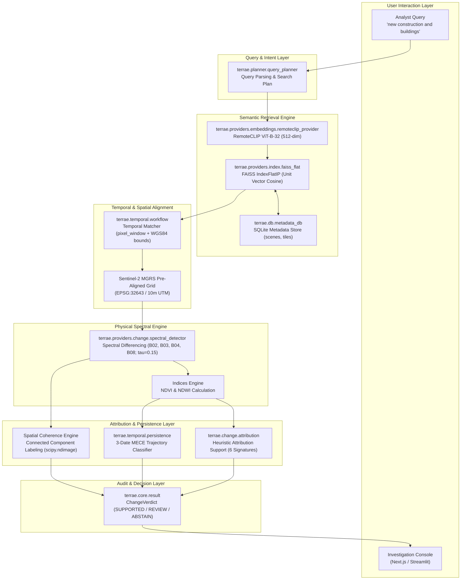

# SIH26227 Technical Report: TERRAE — Semantic Retrieval and Multi-Temporal Change Analysis of Satellite Imagery

---

## 1. PROBLEM STATEMENT

### 1.1 Official Identification & Governance
- **Project Name**: TERRAE — Earth Intelligence Satellite Investigation Console
- **Problem Statement ID**: SIH26227
- **Problem Statement Title**: Semantic Retrieval and Multi-Temporal Change Analysis of Satellite Imagery
- **Organization**: Ministry of Defence / Indian Army — Directorate General of Information Systems (DGIS)
- **Theme**: Space Technology
- **Domain**: GIS / Remote Sensing
- **Target Operational Scope**: Earth Observation (EO) Analyst Workstations, Tactical Geographic Information Systems, and Air-Gapped Intelligence Facilities.

### 1.2 The Core Technical & Operational Challenge
Military and defense geospatial analysts monitor vast, continuous streams of Earth observation data acquired across diverse satellite constellations. Operational intelligence teams face five fundamental bottlenecks when attempting to detect and attribute terrain changes:

1. **Semantic Retrieval of Satellite Imagery**: Satellite archives are cataloged predominantly by geographic coordinates, acquisition timestamps, and cloud-cover percentages. Analysts cannot query imagery using human domain vocabulary (e.g., *"new construction and buildings"*, *"cleared airfields"*, *"water body expansion"*). This forces analysts into time-consuming manual browsing across thousands of candidate tiles.
2. **Multi-Temporal Analysis Beyond Naive Differencing**: Operational change detection traditionally relies on two-date ($T_0 \to T_1$) image subtraction. Two-date differencing is fundamentally vulnerable to false positives caused by ephemeral seasonal phenology, agricultural crop harvesting, illumination shifts, and cloud shadows. Robust operational monitoring requires multi-temporal ($\ge 3$ observation epochs) trajectory analysis to distinguish persistent physical land transformation from transient or seasonal variations.
3. **Multi-Spectral Analysis & Physical Attribution**: Pure change magnitude maps indicate *that* a change occurred, but cannot indicate *what* changed. Effective decision support requires decomposing multi-band spectral responses—such as visible reflectance (Blue, Green, Red), Near-Infrared (NIR), Normalized Difference Vegetation Index (NDVI), and Normalized Difference Water Index (NDWI)—into candidate physical change signatures.
4. **Heterogeneous Satellite Datasets**: Operational imagery originates from heterogeneous sensor platforms (e.g., ESA Sentinel-2 MSI, commercial high-resolution optical, SAR). Varying spatial resolutions, band arrangements, radiometric calibrations, and coordinate reference systems (CRS) hinder standardized analytical processing.
5. **Secure, Offline Operation Requirements**: Defense and intelligence environments require processing classified or sensitive operational data within air-gapped workstations without external network access, remote cloud APIs, or third-party tracking.

---

## 2. SOLUTION

### 2.1 Project Overview: TERRAE — Earth Intelligence Satellite Investigation Console
**TERRAE** is an evidence-based Earth Intelligence satellite investigation console designed specifically to resolve problem statement SIH26227.

In simple language: **TERRAE is not merely a two-image change detector.** Standard change detectors output an uncalibrated, noisy black-and-white mask of altered pixels without context. In contrast, TERRAE is an interactive decision-support system that guides an analyst from a natural-language intent through semantic discovery, multi-band physical evidence extraction, multi-date trajectory persistence testing, and an auditable, conservative verdict.

```
ASK ────────► DISCOVER ────────► COMPARE ────────► EXPLAIN ────────► CHALLENGE ────────► DECIDE
Query         Semantic           Spectral          Evidence-Based    Multi-Temporal       Conservative
Intent        Tile Retrieval     Differencing      Attribution       Trajectory Check     Auditable Verdict
```

### 2.2 The Six-Stage Investigation Workflow
The system structures every satellite investigation through a rigorous six-stage progression:

1. **ASK (Natural-Language Intent)**: The analyst enters an operational query in plain English, such as:
   $$\text{"new construction and buildings"}$$
   The query layer parses the text and prepares a search plan without requiring coordinate lookups or metadata scripting.
2. **DISCOVER (Semantic Retrieval)**: A vision-language foundation model tailored for remote sensing (RemoteCLIP) projects the query into a 512-dimensional joint embedding space. A local vector index performs exact cosine-similarity matching against satellite tile embeddings, retrieving the most semantically relevant satellite scene and region of interest.
3. **COMPARE (Temporal Matching & Spectral Differencing)**: The system queries local metadata to identify co-registered historical and intermediate observations covering the identical geographic bounding box. It applies multi-band spectral differencing across matched observations at a calibrated threshold ($\tau = 0.15$), isolating contiguous changed pixel clusters.
4. **EXPLAIN (Evidence-Based Change Attribution)**: Rather than reporting raw changed pixels, the system analyzes the directional shifts across Blue, Green, Red, and NIR bands alongside spectral indices (NDVI, NDWI). It computes **Attribution Support** scores across mutually exclusive candidate signatures (e.g., Built-Surface vs. Vegetation Dynamics vs. Water).
5. **CHALLENGE (Temporal Evidence & Trajectory Persistence)**: To examine whether detected changes reflect lasting ground transformation or temporary fluctuation, the system ingests three or more chronological observation dates ($T_0 \to T_{\text{mid}} \to T_1$). It tracks pixel-level spectral trajectories across time to evaluate whether the detected change is persistent, transient, late-onset, or reversible.
6. **DECIDE (Conservative Decision Layer)**: The system evaluates multi-pillar evidence (spectral magnitude, spatial coherence, attribution support, and temporal persistence) against deterministic decision criteria. It issues one of three explicit, auditable verdicts:
   - **`SUPPORTED`**: Evidence strongly aligns with the query intent, exceeds change thresholds, demonstrates spatial coherence, and exhibits sustained temporal persistence.
   - **`REVIEW`**: Sub-threshold, diffuse, or ambiguous evidence detected; the system conservatively routes the case to human analyst inspection rather than forcing an automatic affirmative decision.
   - **`ABSTAIN`**: Deficient inputs (e.g., excessive cloud cover, failed co-registration, or fewer than two observations); the system refrains from guessing.

### 2.3 Terminology & Scientific Boundary Disclaimer
To maintain absolute scientific rigor, TERRAE strictly adheres to clear operational terminology:
- **Evidence-Based Change Attribution**: The rule-based decomposition of spectral and spatial shifts into candidate ground-cover interpretations.
- **Attribution Support**: Relative heuristic evidence points allocated to candidate change signatures.
- **Temporal Evidence**: The multi-date trajectory classification of pixels across time.

> [!IMPORTANT]
> **Attribution scores represent heuristic support for candidate change signatures, not calibrated probabilities or causal estimates.** The system does not claim causal conclusions or Bayesian posteriors; it provides traceable physical evidence to assist qualified human analysts.

---

## 3. TECHNICAL APPROACH / METHODOLOGY & PROCESS OF IMPLEMENTATION

### 3.1 System Architecture
TERRAE is organized into modular, decoupled Python components within the core `terrae` analytical package, exposing both an offline Streamlit analysis workstation and a FastAPI REST backend.



### 3.2 Semantic Retrieval Engine
The semantic retrieval engine allows an analyst to locate relevant satellite scenes through cross-modal semantic matching:

- **Embedding Model (`terrae.providers.embeddings.remoteclip_provider`)**: Utilizes **RemoteCLIP ViT-B-32** (Chen et al., 2024), a vision-language foundation model pre-trained on domain-specific remote sensing imagery and captions.
  - *Architecture*: Vision Transformer ViT-B-32 (input resolution $224 \times 224$ pixels, patch size $32$).
  - *Embedding Dimension*: $d = 512$.
  - *Weight Checkpoint*: `RemoteCLIP-ViT-B-32.pt` ($\approx 605\text{ MB}$ staged locally in `models/local/`).
  - *Offline Loading*: Direct PyTorch `torch.load()` of local state dict into bare OpenCLIP architecture with `pretrained=None`. Zero runtime network calls.
- **Vector Index (`terrae.providers.index.faiss_flat`)**: Implemented via FAISS CPU using `IndexIDMap(IndexFlatIP(512))`. Both text query embeddings $\mathbf{q}$ and image tile embeddings $\mathbf{v}_i$ are $L_2$-normalized:
  $$\hat{\mathbf{q}} = \frac{\mathbf{q}}{\|\mathbf{q}\|_2}, \quad \hat{\mathbf{v}}_i = \frac{\mathbf{v}_i}{\|\mathbf{v}_i\|_2}$$
  The inner product computed by FAISS is mathematically identical to cosine similarity:
  $$s(\mathbf{q}, \mathbf{v}_i) = \hat{\mathbf{q}} \cdot \hat{\mathbf{v}}_i = \cos(\theta)$$
- **Metadata Store (`terrae.db.metadata_db`)**: A localized SQLite database (`data/metadata.db`) decoupled from the vector index. Uses stable UUID primary keys (`tile_id`) linking the FAISS index to scene metadata:
  - `scenes`: `scene_id`, `source_path`, `file_hash`, `crs_epsg`, `bounds_wgs84`, `acquisition_date`, `sensor`.
  - `tiles`: `tile_id`, `scene_id`, `pixel_window` (`[col_off, row_off, w, h]`), `bounds_wgs84`, `nodata_fraction`.

### 3.3 Temporal Matching & Spatial Alignment
When an analyst selects a candidate tile, the temporal matcher (`terrae.temporal.workflow`) retrieves all available historical and future observations of that precise physical footprint:

- **Matching Logic**: Multi-temporal observation records are filtered by checking two simultaneous criteria against candidate tiles in the SQLite database:
  $$\text{Match}(T_{\text{target}}, T_{\text{candidate}}) \iff \left( \text{window}(T_{\text{target}}) = \text{window}(T_{\text{candidate}}) \right) \land \left( \text{Overlap}(\text{bounds}_{\text{target}}, \text{bounds}_{\text{candidate}}) > 0 \right)$$
- **Sentinel-2 MGRS Consistency**: Sentinel-2 Level-2A products are distributed pre-tiled along the standard UTM Military Grid Reference System (MGRS). Observations within the same MGRS tile (e.g., `43RGM`) share identical projected coordinate reference systems (EPSG:32643) and aligned $10\text{ m}$ pixel grids. This eliminates sub-pixel geometric warping errors and sets registration status to `REGISTRATION_NOT_REQUIRED`.

### 3.4 Spectral Change Detection
The spectral change detector (`terrae.providers.change.spectral_detector.SpectralChangeDetector`) operates directly on multi-band surface reflectance arrays:

- **Production Bands ($B=4$)**:
  - Band 1: Sentinel-2 $B02$ (Blue, $\lambda \approx 490\text{ nm}$)
  - Band 2: Sentinel-2 $B03$ (Green, $\lambda \approx 560\text{ nm}$)
  - Band 3: Sentinel-2 $B04$ (Red, $\lambda \approx 665\text{ nm}$)
  - Band 4: Sentinel-2 $B08$ (Near-Infrared / NIR, $\lambda \approx 842\text{ nm}$)
- **Reflectance Normalization**: Raw Sentinel-2 uint16 surface reflectance values are scaled to $[0.0, 1.0]$:
  $$I_t(b, x, y) = \text{clip}\left(\frac{\text{DN}(b, x, y)}{10000.0}, 0.0, 1.0\right)$$
- **Mean Absolute Spectral Difference**: For two observation epochs $T_0$ and $T_1$, spectral departure is computed per pixel across all $B$ bands:
  $$\Delta_{\text{mean}}(x, y) = \frac{1}{B} \sum_{b=1}^{B} | I_{T_1}(b, x, y) - I_{T_0}(b, x, y) |$$
- **Production Threshold ($\tau = 0.15$)**: A pixel is classified as changed if and only if its mean spectral shift exceeds $\tau = 0.15$ and it is valid (cloud-free):
  $$M(x, y) = \begin{cases} 1 & \text{if } \Delta_{\text{mean}}(x, y) > 0.15 \text{ and } V(x, y) = 1 \\ 0 & \text{otherwise} \end{cases}$$
- **Change Fraction**:
  $$f_{\text{change}} = \frac{1}{|V|} \sum_{(x, y) \in V} M(x, y)$$
  where $|V|$ is the total count of valid, cloud-free pixels.

### 3.5 Spectral Indices
The attribution engine calculates standardized spectral indices to track physical land-cover transformations (`terrae.change.attribution`):

1. **Normalized Difference Vegetation Index (NDVI)**:
   $$\text{NDVI} = \text{clip}\left(\frac{I(\text{NIR}) - I(\text{Red})}{I(\text{NIR}) + I(\text{Red}) + \epsilon}, -1.0, 1.0\right)$$
2. **Normalized Difference Water Index (NDWI)** (McFeeters, 1996):
   $$\text{NDWI} = \text{clip}\left(\frac{I(\text{Green}) - I(\text{NIR})}{I(\text{Green}) + I(\text{NIR}) + \epsilon}, -1.0, 1.0\right)$$
   where $\epsilon = 10^{-6}$ prevents numerical division by zero.

### 3.6 Evidence-Based Change Attribution
When pixels change ($f_{\text{change}} > 0$), TERRAE computes heuristic **Attribution Support** scores across six candidate change signatures:

| Candidate Signature | Physical & Spectral Criteria |
| :--- | :--- |
| **`BUILT_SURFACE`** | Marked decrease in NIR ($\Delta\text{NIR} < 0$), increase in Red reflectance ($\Delta\text{Red} > 0.04$), strong decrease in NDVI ($\Delta\text{NDVI} < -0.08$), and high spatial coherence ($C > 0.5$). |
| **`VEGETATION_CHANGE`** | Vegetation greening / regeneration: increase in NIR ($\Delta\text{NIR} > 0.05$), decrease in Red ($\Delta\text{Red} < -0.02$), and increase in NDVI ($\Delta\text{NDVI} > 0.08$). |
| **`WATER_CHANGE`** | Expansion of standing water: strong absorption in NIR and Red (end-state $\text{NIR} < 0.18$, $\text{Red} < 0.15$) and positive NDWI shift ($\Delta\text{NDWI} > 0.10$). |
| **`SEASONAL`** | Moderate NDVI shift ($0.03 \le |\Delta\text{NDVI}| \le 0.25$) without severe structural Red disruption ($|\Delta\text{Red}| < 0.08$) and diffuse spatial footprint ($C < 0.5$). |
| **`ARTIFACT`** | Abrupt, uniform shift across all four bands simultaneously ($\text{mean}(|\Delta B|) > 0.2, \text{std}(\Delta B) < 0.04$), indicating cloud boundary, shadow, or sensor calibration anomaly. |
| **`UNCERTAIN`** | Residual support allocated when spectral signatures conflict or remain unresolved. |

Scores are normalized such that $\sum_{k} \text{Support}(k) = 1.0$. If the highest candidate support exceeds $0.30$, it is assigned as the dominant interpretation; otherwise, the case is assigned to `UNCERTAIN`.

### 3.7 Spatial Coherence Analysis
To distinguish real ground structures from salt-and-pepper noise, TERRAE evaluates spatial continuity via connected-component labeling (`scipy.ndimage.label`):
$$\text{Spatial Coherence } C_{\text{spatial}} = \frac{\text{size of largest 8-connected changed component}}{\text{total changed pixels}}$$
- **High Coherence ($C_{\text{spatial}} \to 1.0$)**: Indicates a single compact, contiguous change region (typical of construction, clearing, or building development).
- **Low Coherence ($C_{\text{spatial}} \to 0.0$)**: Indicates diffuse, isolated pixel noise across the scene.
- *Note*: Spatial coherence is a geometric morphological ratio, **not a probability**.

### 3.8 Multi-Temporal Persistence Analysis
To challenge two-date conclusions, TERRAE analyzes multi-temporal trajectories across three chronological observations: $T_0$ (baseline), $T_{\text{mid}}$ (intermediate), and $T_1$ (monitoring).

The system partitions all valid pixels into **five Mutually Exclusive & Collectively Exhaustive (MECE)** canonical categories ($\sum_{k=1}^5 C_k = |V|$):

```
Valid Pixels (100%)
├── 1. STABLE                 (|T_mid - T_0| <= tau AND |T_1 - T_mid| <= tau AND |T_1 - T_0| <= tau)
└── Non-Stable (Changed)
    ├── 2. LATE_ONSET_CHANGE  (|T_mid - T_0| <= tau AND |T_1 - T_0| > tau)
    ├── 3. REVERSIBLE_CHANGE  (|T_mid - T_0| > tau AND departs back towards T_0 at T_1)
    ├── 4. PERSISTENT_CHANGE  (|T_mid - T_0| > tau AND |T_1 - T_0| > tau without return)
    └── 5. TRANSIENT_CHANGE   (Intermediate departure that does not satisfy full return or persistence)
```

1. **`STABLE`**: Spectral difference remains below threshold $\tau = 0.15$ across all three observation intervals ($T_0 \to T_{\text{mid}}$, $T_{\text{mid}} \to T_1$, $T_0 \to T_1$).
2. **`PERSISTENT_CHANGE`**: Departure emerges in $T_0 \to T_{\text{mid}}$ and remains present without returning toward baseline at $T_1$. Indicates lasting land-cover conversion.
3. **`TRANSIENT_CHANGE`**: Spectral departure occurs in $T_0 \to T_{\text{mid}}$, but recedes at $T_1$ without meeting strict geometric reversal criteria.
4. **`LATE_ONSET_CHANGE`**: The scene remains stable through $T_{\text{mid}}$, with meaningful spectral departure emerging only in the final observation interval ($T_{\text{mid}} \to T_1$).
5. **`REVERSIBLE_CHANGE`**: Departure away from $T_0$ in $T_0 \to T_{\text{mid}}$ is followed by a directed return vector from $T_{\text{mid}} \to T_1$ back toward the initial $T_0$ spectral state.

> [!CAUTION]
> **Temporal trajectory evidence is not proof of causality, and reversibility is not automatically proof of seasonality.** Trajectories reflect observed spectral reflections over time; physical cause must be confirmed by qualified operational analysts.

### 3.9 Conservative Decision Layer
The decision engine (`terrae.core.result.ChangeVerdict`) integrates multi-pillar evidence through conservative rules:

- **`SUPPORTED`**: Issued only when:
  1. Co-registration is verified (`REGISTRATION_GOOD` or `REGISTRATION_NOT_REQUIRED`).
  2. Detected change fraction exceeds the minimum threshold ($f_{\text{change}} > 0.05$).
  3. Attribution support identifies a clear dominant signature matching query intent.
  4. Trajectory analysis confirms `PERSISTENT_CHANGE` or `LATE_ONSET_CHANGE`.
- **`REVIEW`**: Issued when change is detected but fails automatic confirmation criteria (e.g., $f_{\text{change}} \le 0.05$, diffuse spatial coherence, mixed attribution support, or reversible trajectories). **`REVIEW` does not indicate a system error or failure**; it is the correct, conservative routing of ambiguous evidence to human analyst inspection.
- **`ABSTAIN`**: Issued when input data fails quality gates:
  1. Registration failure (`REGISTRATION_FAILED`).
  2. Severe cloud corruption or missing spectral bands.
  3. Insufficient observation count ($< 2$ overlapping scenes).

---

### 3.10 Real Sentinel-2 Validation Case
The complete pipeline was evaluated against real Sentinel-2A Level-2A multi-spectral rasters over the National Capital Region (NCR), India. Earth-observation imagery is derived from local GeoTIFF data; the controlled Case 01 benchmark is synthetic.

- **Scene Metadata**:
  - Location: Greater Noida / NCR, India
  - MGRS Tile: `43RGM`
  - Projected CRS: `EPSG:32643` (UTM Zone 43N)
  - Ground Resolution: $10\text{ m}$ per pixel
  - Analysis Footprint: $512 \times 512$ pixel tile ($262,144\text{ valid pixels}$)
  - Cloud Filtering: Scene Classification Layer (SCL) applied ($0\text{ cloud pixels}$ in tested tile).
- **Observation Stack**:
  - $T_0$: **19 May 2023** (Dry pre-monsoon summer)
  - $T_{\text{mid}}$: **06 October 2023** (Post-monsoon vegetation peak)
  - $T_1$: **05 December 2023** (Winter post-harvest dormancy)
- **Verified Empirical Findings**:
  - *Interval Change Fractions ($\tau = 0.15$)*:
    - $T_0 \to T_{\text{mid}}$: $0.7\%$ ($1,820\text{ pixels}$)
    - $T_{\text{mid}} \to T_1$: $0.2\%$ ($619\text{ pixels}$)
    - $T_0 \to T_1$: $1.0\%$ ($2,542\text{ pixels}$)
  - *MECE Trajectory Distribution*:
    - `STABLE`: **$258,869\text{ pixels}$ ($98.75\%$)**
    - `PERSISTENT_CHANGE`: $1,028\text{ pixels}$ ($0.39\%$)
    - `TRANSIENT_CHANGE`: $624\text{ pixels}$ ($0.24\%$)
    - `LATE_ONSET_CHANGE`: $1,373\text{ pixels}$ ($0.52\%$)
    - `REVERSIBLE_CHANGE`: $250\text{ pixels}$ ($0.10\%$)
    - *Sum of MECE Categories*: $262,144\text{ pixels}$ ($100.0\%$)
  - *Spectral Trajectory (Mean over changed pixels)*:
    - $\text{NDVI}$: $+0.192 \to +0.112 \to +0.092$
    - $\text{NDWI}$: $-0.215 \to -0.116 \to -0.095$
    - $\text{NIR}$: $0.480 \to 0.279 \to 0.254$
    - $\text{Red}$: $0.350 \to 0.245 \to 0.224$
  - *Two-Date Spectral Shifts ($T_0 \to T_1$)*:
    - $\Delta\text{Blue} = -8.2\%$, $\Delta\text{Green} = -10.7\%$, $\Delta\text{Red} = -12.6\%$, $\Delta\text{NIR} = -22.6\%$, $\Delta\text{NDVI} = -0.10$, $\Delta\text{NDWI} = +0.12$.
  - *Attribution Support Scores*:
    - Built-surface support: **$51.1\%$**
    - Vegetation-change support: **$24.7\%$**
    - Seasonal support: **$19.9\%$**
    - Unresolved evidence: **$3.1\%$**
    - Water-change support: **$0.6\%$**
    - Artifact support: **$0.6\%$**
  - *Final Verdict*: **`REVIEW`** (Because overall two-date change is $1.0\%$, below the $5.0\%$ threshold required for automatic `SUPPORTED`).
  - *Execution Latency*: $150.0\text{ ms}$ (100% offline).

---

### 3.11 Controlled Synthetic Temporal Benchmark
To validate spatial coherence and multi-temporal trajectory classification under mathematically known, noise-free ground truth, the repository includes a controlled synthetic test suite (`scripts/demo_attribution.py`, Case A):

- **Purpose**: Validates spatial clustering and trajectory partitioning without atmospheric interference.
- **Nature of Case**: **Strictly synthetic benchmark** (Earth-observation imagery is derived from local GeoTIFF data; the controlled Case 01 benchmark is synthetic).
- **Verified Benchmark Results**:
  - Total Changed Fraction: **$11.5\%$** ($7,549\text{ pixels}$)
  - Spatial Coherence: **$99.7\%$** ($24\text{ connected components}$)
  - Attribution Support:
    - Built-surface support: **$97.1\%$**
    - Vegetation-change support: $0.5\%$
    - Seasonal support: $0.5\%$
    - Water-change support: $0.3\%$
    - Artifact support: $0.3\%$
    - Unresolved evidence: $1.3\%$
  - Temporal Persistence: Dominant state **`LATE_ONSET_CHANGE`** ($11.48\%$ of valid pixels).
  - Trajectory Distribution: Stable = $88.5\%$, Late = $11.5\%$, Persistent = $0.0\%$.
  - Final Verdict: **`SUPPORTED`** (Exceeds $5\%$ change threshold with $97.1\%$ built-surface support and $99.7\%$ coherence).

---

### 3.12 OSCD — 5-Pair Validation Subset
The spectral change detector was evaluated against external labeled ground truth from the **Onera Satellite Change Detection (OSCD)** benchmark (Sumin et al., 2018).

- **Benchmark Configuration**:
  - Evaluation Subset: **5 co-registered image pairs** (not the full 24-pair OSCD dataset):
    1. *Aguas Claras* (Brazil)
    2. *Beirut* (Lebanon)
    3. *Bordeaux* (France)
    4. *Cupertino* (United States)
    5. *Mumbai* (India)
  - Total Valid Pixels Evaluated: **$3,025,938\text{ pixels}$**
  - Ground-Truth Changed Pixels: $71,540\text{ pixels}$ ($2.36\%$ of valid pixels)
  - Detector Setup: Fixed production threshold **$\tau = 0.15$**, four bands (Blue, Green, Red, NIR).
  - **Tuning**: **Zero benchmark-driven tuning**; evaluated in exact production state.

#### Quantitative Metrics on OSCD 5-Pair Subset

| OSCD Pair | Ground Resolution | Precision | Recall | F1 Score | IoU | Pixel Accuracy |
| :--- | :--- | :--- | :--- | :--- | :--- | :--- |
| **Aguas Claras** | $10\text{ m}$ | $17.36\%$ | $5.57\%$ | $0.0844$ | $0.0440$ | $98.02\%$ |
| **Beirut** | $10\text{ m}$ | $77.10\%$ | $11.05\%$ | $0.1933$ | $0.1070$ | $97.52\%$ |
| **Bordeaux** | $10\text{ m}$ | $21.14\%$ | $7.35\%$ | $0.1091$ | $0.0577$ | $98.80\%$ |
| **Cupertino** | $10\text{ m}$ | $53.84\%$ | $13.99\%$ | $0.2221$ | $0.1249$ | $97.68\%$ |
| **Mumbai** | $10\text{ m}$ | $91.67\%$ | $1.26\%$ | $0.0248$ | $0.0126$ | $97.47\%$ |

#### Summary Aggregates
- **Micro Aggregate (Pooled over 3,025,938 valid pixels)**:
  - $\text{True Positives (TP)} = 6,952$
  - $\text{True Negatives (TN)} = 2,949,270$
  - $\text{False Positives (FP)} = 5,128$
  - $\text{False Negatives (FN)} = 64,588$
  - **Precision**: **$57.55\%$**
  - **Recall**: **$9.72\%$**
  - **F1 Score**: **$0.1663$**
  - **IoU**: **$0.0907$**
  - **Accuracy**: $97.70\%$
- **Macro Average (Unweighted mean across 5 cities)**:
  - **Precision**: **$52.22\%$**
  - **Recall**: **$7.84\%$**
  - **F1 Score**: **$0.1267$**
  - **IoU**: **$0.0692$**
  - **Accuracy**: $97.90\%$

#### Class Imbalance & Metric Interpretation
> [!WARNING]
> **Pixel Accuracy ($97.70\%$ micro / $97.90\%$ macro) is NOT the headline metric.** Because change detection is subject to extreme class imbalance (only $2.36\%$ of pixels are changed in the ground truth), a trivial dummy classifier predicting $100\%$ unchanged pixels achieves $97.64\%$ accuracy. The scientifically informative metrics are Precision ($57.55\%$), Recall ($9.72\%$), F1 ($0.1663$), and IoU ($0.0907$). The low recall demonstrates that the fixed $\tau=0.15$ threshold operates conservatively, filtering subtle spectral shifts rather than capturing every minor change.

---

### 3.13 Offline / Air-Gapped Architecture
TERRAE is designed from first principles for air-gapped deployment:

- **Local Model Storage**: Foundation model weights reside locally at `models/local/RemoteCLIP-ViT-B-32.pt`.
- **Local Index & Database**: FAISS flat index stored at `data/faiss_index/`; SQLite database at `data/metadata.db`.
- **Air-Gap Verification Mechanism**: Evaluated via `scripts/offline_test.py` under enforced network isolation:
  ```bash
  export HF_HUB_OFFLINE=1
  export TRANSFORMERS_OFFLINE=1
  python scripts/offline_test.py
  ```
- **Verification Outcome**:
  - Model loading: $4.94\text{ s}$ (100% offline).
  - Text embedding ($512$-dim): $48.6\text{ ms}$.
  - Image tile embedding ($512$-dim): $82.4\text{ ms}$.
  - FAISS index search ($24\text{ vectors}$): $2.00\text{ ms}$.
  - End-to-end retrieval query: $66.1\text{ ms}$.
  - External network calls: **ZERO** (verified by network inspection and offline flags).

### 3.14 Automated Testing & Verification
The repository maintains an automated test suite executed via `pytest tests/ -q`:
- **Verified Test Count**: **135 / 135 tests passed (100%)** in $8.63\text{ seconds}$.
- **Test Coverage Areas**:
  1. `test_persistence.py`: MECE trajectory partitioning, reversal vector math, 5 canonical categories.
  2. `test_attribution.py`: Spectral indices, spatial coherence bincounts, heuristic support normalization.
  3. `test_benchmark_oscd.py`: OSCD metric calculations, binary conversions, multi-pair aggregation determinism.
  4. `test_retrieval.py`: Query parsing, FAISS vector indexing, top-$k$ ranking.
  5. `test_pipeline.py` & `test_reader.py`: GeoTIFF reading, CRS validation, SCL quality masking.
  6. `test_sensors.py`: Multi-band adapter normalization for Sentinel-2.

---

## 4. FEASIBILITY & VIABILITY

### 4.1 Technical Feasibility
- **Local Workstation Execution**: The system requires no specialized high-performance computing clusters. RemoteCLIP ViT-B-32 ($605\text{ MB}$) and FAISS CPU execute comfortably within $8\text{ GB}$ to $16\text{ GB}$ of RAM on standard x86-64 workstations.
- **Standard Geospatial Formats**: Uses native GDAL/Rasterio bindings for standard GeoTIFF-based satellite data and multi-band raster formats.
- **Deterministic Analytical Pipeline**: Once imagery is embedded, the spectral differencing, spatial coherence, and MECE trajectory algorithms execute deterministically without stochastic variation.

### 4.2 Operational Feasibility
- **Air-Gapped Compliance**: The entire pipeline operates with zero external network connectivity, fully meeting military security guidelines for classified enclave operation.
- **Analyst Workstation Model**: Designed as an analyst-in-the-loop decision-support tool. It automates repetitive spatial catalog searches and presents transparent, decomposed evidence chains rather than opaque black-box verdicts.
- **Reproducibility**: The analytical pipeline is fully deterministic; all detection parameters ($\tau = 0.15$), observation timestamps, spatial windows, and evidence metrics are recorded in structured dataclasses (`TemporalChangeResult`, `AttributionResult`), ensuring repeatable verification without stochastic drift.

### 4.3 Scalability Analysis (Architectural Potential)
- **Vector Index Scalability**: While the current deployment uses FAISS `IndexFlatIP` (exact brute-force search on small collections), the index backend interface (`terrae.providers.index.base.IndexBackend`) supports swapping to `IndexIVFFlat` or `IndexHNSWFlat` for million-tile collections without altering pipeline logic.
- **Multi-Date Extensions**: The trajectory classifier can be generalized from 3 dates to arbitrary $N$-date dense time series via sliding-window trajectory smoothing.
- **Sensor Extension**: The sensor registry pattern (`terrae.providers.sensors.registry`) provides clean extension points for synthetic aperture radar (SAR / Sentinel-1) and thermal sensors.

---

## 5. IMPACT & BENEFITS

### 5.1 Measurable Operational Benefits
1. **Accelerated Semantic Scene Discovery**: Analysts locate relevant satellite scenes by describing physical intent in plain language rather than manually querying coordinate bounding boxes or filtering metadata spreadsheets.
2. **Multi-Temporal Trajectory Disambiguation**: Multi-temporal persistence analysis provides additional evidence for distinguishing transient or reversible variation from persistent change (e.g., distinguishing seasonal vegetation cycles from lasting construction).
3. **Evidence Traceability & Decomposed Attribution**: Changes are broken down into measurable spectral shifts ($\Delta\text{NIR}, \Delta\text{Red}, \Delta\text{NDVI}, \Delta\text{NDWI}$) and spatial clustering ratios, giving analysts clear physical evidence.
4. **Conservative Decision Support**: By routing sub-threshold or ambiguous cases to `REVIEW` instead of forcing an automated affirmative change decision, the system preserves human oversight in high-stakes operational environments.
5. **Secure Tactical Deployment**: Zero external API dependencies ensure complete operational sovereignty within restricted command networks.

---

## 6. RESEARCH & REFERENCES

### A. Official / Problem Statement
- **Smart India Hackathon (SIH 2026)**: Problem Statement SIH26227, Ministry of Defence / Indian Army — Directorate General of Information Systems (DGIS). Theme: Space Technology. Domain: GIS / Remote Sensing.

### B. Satellite Data & Spatial Standards
- **Copernicus Sentinel-2**: European Space Agency (ESA) Sentinel-2 User Handbook and Level-2A Algorithm Theoretical Basis Document (ATBD). Sentinel-2 MSI multispectral surface reflectance products.
- **Open Geospatial Consortium (OGC)**: GeoTIFF Format Specification, EPSG Geodetic Parameter Registry.

### C. Benchmark Datasets
- **OSCD (Onera Satellite Change Detection)**: Daudt, R. C., Le Saux, B., Boulch, A., & Gousseau, Y. (2018). *Urban Change Detection for Multispectral Earth Observation Using Convolutional Networks.* IEEE International Geoscience and Remote Sensing Symposium (IGARSS 2018). [Dataset: 5-pair validation subset evaluated].

### D. Research Papers & Foundation Models
- **RemoteCLIP**: Chen, D., Qi, J., Shen, R., Guan, Z., Chen, Z., & Zou, Z. (2024). *RemoteCLIP: A Vision-Language Foundation Model for Remote Sensing.* IEEE Transactions on Geoscience and Remote Sensing (TGRS). Checkpoint: `chendelong/RemoteCLIP` (CC BY 4.0).
- **Normalized Difference Vegetation Index (NDVI)**: Rouse, J. W., Haas, R. H., Schell, J. A., & Deering, D. W. (1974). *Monitoring Vegetation Systems in the Great Plains with ERTS.* NASA SP-351.
- **Normalized Difference Water Index (NDWI)**: McFeeters, S. K. (1996). *The Use of the Normalized Difference Water Index (NDWI) in the Delineation of Open Water Features.* International Journal of Remote Sensing, 17(7), 1425–1432.

### E. Software & Open-Source Libraries
- **FAISS**: Johnson, J., Douze, M., & Jégou, H. (2019). *Billion-scale similarity search with GPUs.* IEEE Transactions on Big Data. Library: `faiss-cpu`.
- **Rasterio**: Gillies, S., et al. (2013–2024). *Rasterio: geospatial raster I/O for Python.* Built on GDAL.
- **PyTorch**: Paszke, A., et al. (2019). *PyTorch: An Imperative Style, High-Performance Deep Learning Library.* NeurIPS.
- **SciPy**: Virtanen, P., et al. (2020). *SciPy 1.0: Fundamental Algorithms for Scientific Computing in Python.* Nature Methods (`scipy.ndimage.label`).

---

## LIMITATIONS

To maintain complete scientific integrity, the following operational and algorithmic limitations are explicitly acknowledged:

1. **Threshold-Based Change Detector**: The production spectral detector uses a fixed threshold ($\tau = 0.15$) across four bands. It does not employ a deep neural segmentation network (e.g., ChangeFormer/BIT-CD) and therefore has lower recall on subtle, mixed-pixel urban changes.
2. **Conservative Sensitivity & Low Benchmark Recall**: On the OSCD 5-pair validation subset, the detector achieved $9.72\%$ recall alongside $57.55\%$ precision. It is designed as a conservative change candidate filter, not a high-recall segmentation network.
3. **Limited Benchmark Subset**: OSCD evaluation was conducted strictly on a 5-pair subset ($3,025,938\text{ pixels}$), not the complete 24-pair OSCD dataset.
4. **Heuristic Attribution Support**: Attribution scores are heuristic rule-based support weights derived from physical indices. They are **not calibrated Bayesian probabilities** and **not causal proofs**.
5. **Synthetic Controlled Case**: Case A in the attribution demo is a synthetic benchmark designed to test spatial clustering logic; Earth-observation imagery is derived from local GeoTIFF data; the controlled Case 01 benchmark is synthetic.
6. **No Universal Generalization Claim**: Performance demonstrated on Sentinel-2 MGRS `43RGM` (NCR India) and the OSCD 5-pair subset does not constitute a guarantee of universal generalization across all sensor platforms or cloud-heavy geographies.

---

## REPRODUCIBILITY

Every finding, metric, and test reported in this document is 100% reproducible from the repository using the exact commands below:

### 1. Environment Setup
```bash
# Clone repository
git clone https://github.com/PhantomCipher13/terrae-geospatial-intelligence.git
cd terrae-geospatial-intelligence

# Create and activate virtual environment
python -m venv venv
# Linux / macOS:
source venv/bin/activate
# Windows PowerShell:
.\venv\Scripts\Activate.ps1

# Install exact dependencies
pip install -r requirements.txt
```

### 2. Run Automated Test Suite (135 Tests)
```bash
pytest tests/ -q
# Expected outcome: 135 passed in ~8.6 seconds
```

### 3. Run Real Sentinel-2 Validation (MGRS 43RGM)
```bash
python scripts/validate_real_sentinel.py
# Validates 3-date stack (May/Oct/Dec 2023), 262,144 valid pixels, 98.75% STABLE, REVIEW verdict
```

### 4. Run Evidence-Based Attribution Demo (Cases A, B, C)
```bash
python scripts/demo_attribution.py
# Validates synthetic controlled case (11.5% change, 97.1% built support, SUPPORTED verdict)
```

### 5. Run OSCD 5-Pair Benchmark Validation
```bash
python scripts/benchmark_oscd.py --threshold 0.15
# Evaluates 3,025,938 valid pixels across 5 pairs: Precision 57.55%, Recall 9.72%, F1 0.1663
```

### 6. Run 100% Air-Gapped Verification
```bash
# Enforce offline flags
export HF_HUB_OFFLINE=1
export TRANSFORMERS_OFFLINE=1
# (On Windows PowerShell: $env:HF_HUB_OFFLINE="1"; $env:TRANSFORMERS_OFFLINE="1")

python scripts/offline_test.py
# Confirms 100% offline model loading, FAISS search, metadata query, and ZERO network calls
```

### 7. Run Applications Locally
```bash
# Option A: Streamlit Investigation Console
streamlit run ui/app.py

# Option B: FastAPI Backend Server
uvicorn backend.main:app --host 127.0.0.1 --port 8000
```
